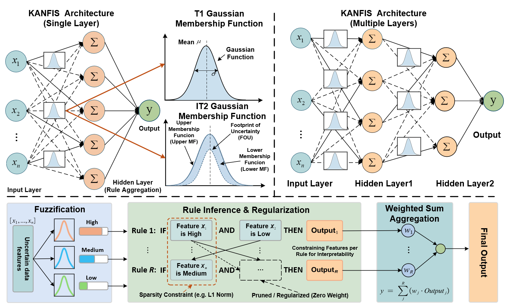

# KANFIS: A Neuro-Symbolic Framework for Interpretable and Uncertainty-Aware Learning

KANFIS is a compact research implementation of Type-1 KANFIS (IT1-KANFIS)
and interval Type-2 KANFIS (IT2-KANFIS). It provides scikit-learn-style
estimators for regression and classification, a lower-level PyTorch training
API, and numeric extraction of learned fuzzy rules.

In this code, IT2 denotes interval Gaussian antecedents followed by a midpoint
approximation of their lower and upper membership values. It does not propagate
interval endpoints to the output and does not implement Karnik-Mendel type
reduction. Paper descriptions and comparisons should use this precise scope.

This repository is arranged as a reproducible research-code
release. It uses only datasets bundled with scikit-learn and writes generated
artifacts under the ignored `outputs/` directory.

Chinese documentation: [`docs/README_zh.md`](docs/README_zh.md)

## Abstract

Adaptive Neuro-Fuzzy Inference System (ANFIS) was designed to combine the learning capabilities of neural network with the reasoning transparency of fuzzy logic. However, conventional ANFIS architectures suffer from structural complexity, where the product-based inference mechanism causes an exponential explosion of rules in high-dimensional spaces. We herein propose the Kolmogorov-Arnold Neuro-Fuzzy Inference System (KANFIS), a compact neuro-symbolic architecture that unifies fuzzy reasoning with additive function decomposition. KANFIS employs an additive aggregation mechanism, under which both model parameters and rule complexity scale linearly with input dimensionality rather than exponentially. Furthermore, KANFIS is compatible with both Type-1 (T1) and Interval Type-2 (IT2) fuzzy logic systems, enabling explicit modeling of uncertainty and ambiguity in fuzzy representations. By using sparse masking mechanisms, KANFIS generates compact and structured rule sets, resulting in an intrinsically interpretable model with clear rule semantics and transparent inference processes. Empirical results demonstrate that KANFIS achieves competitive performance against representative neural and neuro-fuzzy baselines.

## Architecture



*Figure 1. Conceptual overview of KANFIS, including single-layer and multilayer architectures, T1/IT2 Gaussian membership functions, and rule inference with regularization and weighted aggregation.*

The linguistic labels in the figure illustrate the paper's conceptual framework.
This release exports numeric rule parameters; see [Method Notes and Limits](#method-notes-and-limits) for implementation scope.

## Installation

Python 3.10, 3.11, or 3.12 is required by the pinned environment.

```bash
python -m venv .venv
```

Linux/macOS:

```bash
source .venv/bin/activate
```

Windows PowerShell:

```powershell
.venv\Scripts\Activate.ps1
```

After activating the environment:

```bash
python -m pip install --upgrade pip
python -m pip install -e .
```

For development checks:

```bash
python -m pip install -e ".[test]"
python -m pytest
```

## Regression: `fit` and `predict`

```python
from sklearn.datasets import load_diabetes
from sklearn.model_selection import train_test_split
from kanfis import KANFISRegressor

data = load_diabetes()
X_train, X_test, y_train, y_test = train_test_split(
    data.data, data.target, test_size=0.2, random_state=42
)

model = KANFISRegressor(
    variant="it1",
    n_rules=8,
    n_memberships=3,
    max_epochs=100,
    random_state=42,
)
model.fit(X_train, y_train)
y_pred = model.predict(X_test)
```

The regressor standardizes features and the training target internally.
Predictions are returned on the original target scale.

## Classification: `fit`, `predict`, and `predict_proba`

```python
from sklearn.datasets import load_iris
from sklearn.model_selection import train_test_split
from kanfis import KANFISClassifier

data = load_iris()
labels = data.target_names[data.target]
X_train, X_test, y_train, y_test = train_test_split(
    data.data,
    labels,
    test_size=0.2,
    random_state=42,
    stratify=labels,
)

model = KANFISClassifier(
    variant="it2",
    n_rules=8,
    n_memberships=3,
    max_epochs=100,
    random_state=42,
)
model.fit(X_train, y_train)
labels = model.predict(X_test)
probabilities = model.predict_proba(X_test)
```

Classification accepts numeric or string labels. `predict` restores the
original labels and `predict_proba` returns one column per `model.classes_`.

## Hyperparameter Interface

Constructor parameters are compatible with scikit-learn's configuration API:

```python
model = KANFISRegressor()
model.set_params(
    variant="it2",
    n_rules=12,
    n_memberships=4,
    learning_rate=5e-4,
    lambda_entropy=0.01,
    lambda_distinct=0.01,
)
print(model.get_params())
model.fit(X_train, y_train)
```

Key parameters:

| Parameter | Meaning | Default |
| --- | --- | --- |
| `variant` | `"it1"` or `"it2"` | `"it1"` |
| `n_rules` | First-layer rule nodes | `8` |
| `n_memberships` | Membership functions per feature-rule edge | `3` |
| `n_layers` | KANFIS layers | `1` |
| `membership` | IT1: Gaussian, sigmoid, or triangle; IT2: Gaussian | `"gaussian"` |
| `learning_rate` | AdamW base learning rate | `1e-3` |
| `batch_size` | Mini-batch size | `32` |
| `max_epochs` | Maximum training epochs | `100` |
| `validation_fraction` | Internal validation share | `0.2` |
| `patience` | Early-stopping patience | `20` |
| `lambda_entropy` | Feature-mask entropy penalty | `0.0` |
| `lambda_distinct` | Rule-response distinctness penalty | `0.0` |
| `random_state` | Split, initialization, and loader seed | `42` |
| `device` | `"auto"`, `"cpu"`, or a valid PyTorch device | `"auto"` |

Explicit validation data can be passed as a pair:

```python
model.fit(X_train, y_train, X_val=X_validation, y_val=y_validation)
```

## Low-Level `train` API

Use `KANFISTrainer` when data preparation and DataLoaders are controlled by an
experiment pipeline. The low-level API does not scale data.

```python
import torch
from sklearn.datasets import load_diabetes
from sklearn.model_selection import train_test_split
from sklearn.preprocessing import StandardScaler
from torch.utils.data import DataLoader, TensorDataset
from kanfis import IT1KANFISNetwork, KANFISTrainer

data = load_diabetes()
X_train, X_val, y_train, y_val = train_test_split(
    data.data, data.target, test_size=0.2, random_state=42
)
x_scaler = StandardScaler().fit(X_train)
y_scaler = StandardScaler().fit(y_train.reshape(-1, 1))

def make_loader(X, y, *, shuffle):
    return DataLoader(
        TensorDataset(
            torch.as_tensor(x_scaler.transform(X), dtype=torch.float32),
            torch.as_tensor(
                y_scaler.transform(y.reshape(-1, 1)), dtype=torch.float32
            ),
        ),
        batch_size=32,
        shuffle=shuffle,
    )

train_loader = make_loader(X_train, y_train, shuffle=True)
val_loader = make_loader(X_val, y_val, shuffle=False)
network = IT1KANFISNetwork(
    in_features=X_train.shape[1],
    n_rules=8,
    out_features=1,
    n_memberships=3,
)
trainer = KANFISTrainer(
    network,
    task="regression",
    learning_rate=1e-3,
    device="cpu",
)
history = trainer.train(train_loader, val_loader, max_epochs=100, patience=20)
```

This separate object preserves the standard PyTorch meaning of
`network.train(mode)`.

## Rule Output API

```python
rules = model.get_rules(
    feature_names=data.feature_names,
    threshold=0.05,
)
model.export_rules(
    "outputs/rules.json",
    feature_names=data.feature_names,
    threshold=0.05,
)
model.export_rules(
    "outputs/rules.txt",
    feature_names=data.feature_names,
    threshold=0.05,
)
```

Each record contains a stable rule index, selected feature antecedents, raw
mask values, learned membership centers and widths, and consequent weights.
High-level estimator exports reverse internal scaling, so feature parameters
and regression consequents use the original data units. Low-level
`extract_rules(network)` calls without scaler arguments report `network` space.
IT2 records contain lower and upper widths. Classification consequents are
keyed by original class labels. The exporter intentionally reports numeric
parameters instead of assigning untrained linguistic labels such as "low" or
"high".

## Reproduce the Included Experiments

Four YAML configurations cover both model variants and both task types:

```bash
python scripts/run_experiment.py --config configs/diabetes_it1.yaml
python scripts/run_experiment.py --config configs/diabetes_it2.yaml
python scripts/run_experiment.py --config configs/iris_it1.yaml
python scripts/run_experiment.py --config configs/iris_it2.yaml
```

Run all checked-in configurations and create one summary table:

```bash
python scripts/run_all.py
```

Each run writes to `outputs/<dataset>/<variant>/seed_<seed>/`:

- `config.yaml`: exact resolved experiment configuration.
- `metrics.json`: RMSE/MAE/R-squared or accuracy/macro-F1.
- `history.json`: training and validation losses.
- `environment.json`: resolved device and package versions.
- `rules.json` and `rules.txt`: learned rule parameters.
- `model.pt`: network, preprocessing, label, and estimator state.

The batch runner also writes `outputs/summary.csv`. No benchmark numbers are
checked into this repository.

## Repository Structure

```text
configs/          Reproducible YAML experiment definitions
examples/         Minimal sklearn-dataset API examples
scripts/          Single-run and batch experiment entry points
src/kanfis/       Networks, trainer, estimators, and rule export
tests/            Network, trainer, estimator, rule, and script contracts
docs/             Chinese guide and architecture figure
outputs/          Ignored generated artifacts
```

## Method Notes and Limits

- IT1-KANFIS supports Gaussian, sigmoid, and triangle membership functions.
- IT2-KANFIS models an interval of Gaussian widths and uses the midpoint of the
  lower and upper membership values for type reduction.
- Deeper KANFIS layers are supported for prediction, but rule extraction
  requires `n_layers=1` so final weights remain direct rule consequents.
- Regression is single-output. Classification supports binary and multiclass
  targets.
- The low-level trainer expects already prepared numeric tensors.
- Canonical YAML configurations use CPU and exact dependency versions. The API
  also accepts `device="auto"`, which selects CUDA when available.

Run the tests and experiment configurations in the target environment before
reporting experimental results.

## Citation

If you use KANFIS in your research, please cite:

```bibtex
@inproceedings{yong2026kanfis,
  title     = {{KANFIS}: A Neuro-Symbolic Framework for Interpretable and Uncertainty-Aware Learning},
  author    = {Yong, Binbin and Pei, Haoran and Shen, Jun and Li, Haoran and Zhou, Qingguo and Su, Zhao},
  booktitle = {Proceedings of the 43rd International Conference on Machine Learning},
  year      = {2026}
}
```
